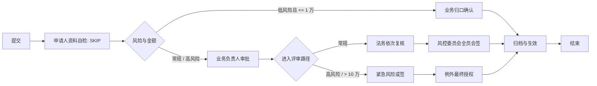

# 合同例外评审：节点、业务场景与运行时逻辑

本文说明 [`contract_exception_review_v1`](../script/bpmn/contract_exception_review_v1.bpmn.xml) 这个**复杂能力验收流程**。它刻意不绑定合同域表、`system_user` 或本地角色表：业务系统与身份目录仍属于 Portal，BPM 只保存 Portal 原始 String ID 并驱动任务状态机。

它不是可直接照搬的生产合同模板。生产接入时，保留节点语义和 Portal 契约，替换本地 mock 角色目录、表单字段与业务侧归档/生效回调。

## 流程概览



`riskLevel == 'LOW' && totalAmount <= 10000` 走低风险直通；`riskLevel == 'HIGH' || totalAmount > 100000` 在业务负责人审批后走紧急路径；其余走法务与风控全员评审。该条件在 BPMN 中出现两次，是为了分别控制“是否进入业务负责人节点”和“负责人完成后进入哪条评审路径”。

## 候选人、身份与任务创建

所有用户任务都先经过 `BpmTaskCandidateInvoker.calculateAssigneeIdsByTask`：按策略解析候选人、过滤无效 Portal 用户，再将结果作为 String ID 交给 Flowable。多实例节点由自定义串行/并行行为根据这组 ID 创建任务，而不是依据 BPMN 的 `loopCardinality` 产生固定数量任务。

| 配置 | 含义 | 本流程中的使用 |
| --- | --- | --- |
| `candidateStrategy=35` | 发起时由 Portal 在 `startUserSelectAssignees` 传入最终 String ID | 申请人自检、业务负责人、法务串行复核、最终授权 |
| `candidateStrategy=70` | 节点到达时调用 `PortalRoleCandidateApi`，按 `candidateParam` 返回最终 String ID 集合 | 业务归口、风控全员会签、风控或签、归档 |
| `assignStartUserHandlerType=2` | 审批人等于发起人时自动跳过 | 仅申请人资料自检显式使用 |

`70` 不会把角色编码写成任务办理人。`PortalRoleCandidateStrategy` 会以 `startUserId`、`activityId`、`roleCode` 和 `processInstanceId` 调用 Portal；若 Portal 未接入或返回空候选人，流程失败关闭，绝不回退查询本地用户/角色表。当前本地演练由 `LocalPortalRoleCandidateApiMock` 按“节点 ID + 角色编码”给出固定 String ID，真实环境应提供同一端口的 Portal HTTP/SDK 适配器。

## 节点映射

| BPMN 节点 | 业务场景 | 分配与 BPMN 语义 | 运行时代码路径 | walkthrough 验收 |
| --- | --- | --- | --- | --- |
| `Activity_RequesterSelfCheck` | 发起前资料自检；此例用来验证发起人与审批人相同的处理 | `35`，发起人自身；显式 `SKIP` | 任务被分配后，`BpmTaskServiceImpl.processTaskAssigned` 识别“非发起节点 + assignee 等于 startUser”，调用 `approveTask` 自动完成；退回到该节点时受 return flag 保护，不自动跳过 | 常规、风险、拒绝、低风险四条实例均无人工待办地越过此节点 |
| `Gateway_Risk` | 以风险等级与金额决定是否直通 | 排他网关；低风险直通，否则进入业务负责人 | Flowable 表达式求值；发起前 `BpmProcessInstanceServiceImpl.validateStartUserSelectAssignees` 只校验当前条件下会经过的 35 节点 | 低风险场景直达业务归口；其余进入业务负责人 |
| `Activity_BusinessOwner` | 低风险合同例外由归口部门确认 | `70` + `ROLE_BUSINESS_OWNER`，单人 | `PortalRoleCandidateStrategy` → `PortalRoleCandidateApi` → `BpmUserTaskActivityBehavior` 创建任务 | 由 `portal-business-owner-g1h2` 办理后进入归档 |
| `Activity_Manager` | 业务方为常规/高风险例外承担第一道审批责任；也是委派、前加签和转办的操作锚点 | `35`，发起时指定业务负责人 | `BpmTaskCandidateStartUserSelectStrategy` 从流程变量读取指定人；普通同意走 `approveTask` | 常规场景验证委派与前加签；高风险场景验证转办；拒绝场景在此终止 |
| `Activity_LegalSequential` | 法务按指定顺序分别复核，可将材料退回业务负责人补充 | `35`，串行多实例，完成条件为全部完成；有 30 秒非中断提醒边界事件 | `BpmSequentialMultiInstanceBehavior` 以 `LinkedHashSet` 保持 Portal 传入顺序；`returnTask` 先检查顺序可达性，再用 `moveActivityIdsToSingleActivityId` 回退并写入 return flag | 法务 A → 退回业务负责人 → A、B 重新顺序办理；30 秒后原任务仍可办理 |
| `Boundary_LegalReminder` | 法务超时只催办，不推进、不拒绝 | `cancelActivity=false`，`boundaryEventType=1`，`timeoutHandlerType=1`，`PT30S` | `BpmTaskEventListener` 捕获边界 timer，调用 `processTaskTimeout`；类型 1 调用 `messageService.sendMessageWhenTaskTimeout` | 验证 timer 触发后任务没有被中断；最终通知投递由 Portal 消息适配器负责，不在脚本中伪造断言 |
| `Activity_RiskAllSign` | 常规例外需风险委员全部确认 | `70` + `ROLE_RISK`，并行多实例；`nrOfCompletedInstances == nrOfInstances` | `BpmParallelMultiInstanceBehavior` 根据 Portal 角色解算的两个 ID 各创建一个任务；必须全数完成 | 风控 A、B 均同意后才进入归档 |
| `Activity_RiskAnySign` | 高风险/超额情形先由任一风控委员快速放行 | `70` + `ROLE_RISK`，并行多实例；`nrOfCompletedInstances > 0` | 同上；第一个完成实例满足完成条件，Flowable 结束其余未完成实例 | 风控 A 同意后直接出现最终授权节点 |
| `Activity_ExecutiveReview` | 高风险例外需最终授权人明确确认 | `35`，发起时动态指定 | 标准 `approveTask`；高风险场景先在上游 `transferTask` 将业务负责人任务改派给最终授权人 | `portal-executive-n6p7` 先接管业务负责人任务，再办理最终授权 |
| `Activity_FinalArchive` | 流程结束前由流程管理员确认归档/生效 | `70` + `ROLE_ADMIN` | Portal 角色解算后创建单个 Flowable 任务；完成后到 EndEvent | 三个通过场景均由 `portal-admin-d5e6` 完成 |

## 任务操作与状态机语义

### 委派、转办与前加签

常规场景先在 `Activity_Manager` 执行委派。`delegateTask` 记录委派评论、保留原办理人为 `owner`，再调用 Flowable `delegateTask` 将当前 `assignee` 改为受委派人。受委派人调用 `approveTask` 时检测到 `DelegationState.PENDING`，只执行 `resolveTask`，任务回到 owner；这不是最终完成流程节点。

前加签同样发生在 `Activity_Manager`。`createSignTask(..., type='before')` 将父任务的原 assignee 放到 `owner`，置空父任务 assignee 并标记等待；每个加签人获得独立子任务。所有子任务完成后，`handleParentTaskIfSign` 对父任务调用 `resolveTask`，原办理人才能继续审批。这解释了 walkthrough 中“法务预审通过后，业务负责人重新出现”的现象。

高风险场景使用转办而非委派：`transferTask` 将当前 assignee 改为目标 Portal 用户，目标用户可直接完成该节点，不存在“完成后回原办理人”的 `DelegationState.PENDING` 阶段。

### 退回与拒绝

`returnTask` 只接受顺序可达的目标节点。执行时，它会对当前路径中其他运行任务做取消/退回状态处理，再用 Flowable `ChangeActivityStateBuilder` 将相关活动移动到指定节点，同时写入 return flag。该标记避免“退回到发起人同人节点后立刻被 SKIP”的循环。

本流程没有为任何节点配置 `rejectHandlerType=RETURN_USER_TASK`，所以 `rejectTask` 采用默认处理：写入拒绝状态与评论、将实例标为拒绝，然后 `moveTaskToEnd` 结束流程。walkthrough 的拒绝场景最终状态为 `3`。

## 表单与 Portal 发起契约

表单 code 是 `contract_exception_review_v1_form`，定义在 [`init-mock-data.sql`](../script/sql/init-mock-data.sql)。发布脚本按 code 查询实际表单 ID，再用 multipart `POST /admin-api/bpm/process-definition/deploy-xml` 部署 BPMN；因此不应在业务代码或 SQL 中假定该表单 ID。

常规场景的关键发起入参结构如下：

```json
{
  "processDefinitionId": "<deployed-definition-id>",
  "variables": {
    "contractTitle": "...",
    "exceptionType": "付款条件例外",
    "riskLevel": "STANDARD",
    "totalAmount": 50000,
    "exceptionReason": "..."
  },
  "startUserSelectAssignees": {
    "Activity_RequesterSelfCheck": ["portal-requester-a1f2"],
    "Activity_Manager": ["portal-manager-b3c4"],
    "Activity_LegalSequential": ["portal-legal-h2j3", "portal-legal-j3k4"]
  }
}
```

不要为 70 节点传 `startUserSelectAssignees`；它们会在抵达节点时从 Portal 角色目录重新解算。也不要将显示名称或数值本地用户 ID 作为办理人：Flowable 任务、待办授权和审计链路的权威值都是 Portal String ID。

## 已验证范围与生产接入缺口

2026-08-13 的本地 walkthrough 已实际部署本 BPMN，并验证四条实例：常规复杂链路、高风险转办与或签、拒绝终止、低风险角色解算。四条实例均已结束，未遗留运行中 Flowable 任务。

本流程当前不包含合同领域 Java listener。这是有意的：流程运行时只证明工作流与 Portal 边界。生产接入仍需在流程完成、归档或业务状态变更的位置增加幂等的 Portal/业务系统回调，并定义失败重试与审计策略；不能把本地 mock 的“归档与生效确认”误认为已完成真实合同数据写入。
