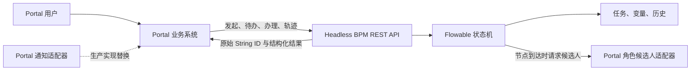

# Headless BPM 项目演示说明：自研改造亮点与现场主线

本文是**整个 Headless BPM 项目**的演示稿，不是某一张 BPMN 的节点说明。目标是让听众理解：项目把 RuoYi-Vue-Pro + Flowable 从“后台自带组织和页面的审批系统”，改造成可由外部 Portal 驱动的工作流中台。

## 一句话定位

> Portal 管业务、页面、用户和组织；BPM 管流程定义、状态机、任务流转与审计。两端通过稳定 REST 契约和 Portal 原始 String ID 协作。

## 自研改造亮点

| 亮点 | 我们做了什么 | 演示时如何证明 |
| --- | --- | --- |
| 无头化与零用户同步 | 用 `BpmPortalIdentityApi`、`BpmPortalOrganizationApi` 等端口隔离 Portal 身份和组织；BPM 不查询本地 `system_user`、`system_role`、`system_dept`。 | 展示接口响应中的 Portal String ID；说明 Portal 是用户/部门/角色唯一事实来源。 |
| String ID 端到端传递 | 发起人、任务办理人、候选人、待办授权和审批历史都以 Portal 原始 String ID 工作，避免 UUID/外部 ID 被转为本地数值 ID。 | 发起请求与待办响应中使用 `portal-...` ID，而不是本地用户主键。 |
| 动态审批人策略 | `35`（发起时由 Portal 指定最终用户）和 `70`（节点到达时由 Portal 按角色解算）被明确区分；`70` 无候选人或适配器缺失时失败关闭。 | 用流程图中的 35/70 节点与待办切换证明“角色不是办理人，解析出的 String ID 才是”。 |
| API 驱动的流程生命周期 | 新增/固化 XML 一键部署入口 `POST /admin-api/bpm/process-definition/deploy-xml`，并按 `bpm_form.code` 查询实际表单 ID；Portal 使用发起、待办、办理、轨迹 API 驱动流程。 | 用上传 BPMN 的 multipart 请求，再展示发起与审批详情。 |
| Flowable 复杂状态机语义 | 保留并验收串/并行会签、或签、委派、转办、加签、退回、拒绝、非中断催办等真实任务语义。 | 用“合同例外评审全场景流程”按场景演示，强调不是前端串行调用。 |
| 可复用的子流程 | 通过 Call Activity 调用独立定义的子流程，父、子拥有各自流程实例和历史；父流程轨迹能关联子流程实例 ID。 | 用“采购申请（含合规子流程）”演示高金额分流、子流程结束后父流程恢复。 |
| 可重复验收资产 | BPMN、mock 表单 SQL、最小 Portal mock、HTTP-only walkthrough、节点说明和定向测试均随仓库版本管理。 | 展示 `script/bpmn/`、`script/sql/`、`script/shell/`；运行 walkthrough 生成审阅结果。 |

## 20 分钟现场演示脚本

| 时间 | 操作 | 要说清的结论 |
| --- | --- | --- |
| 0–2 分钟 | 打开本文件的架构图和 [架构契约](PORTAL_HEADLESS_BPM_ARCHITECTURE.md)。 | 目标不是重做 Portal，而是把 BPM 变成可嵌入业务系统的流程中台。 |
| 2–5 分钟 | 展示发起、待办、同意/拒绝、审批轨迹四类 API。 | Portal 只表达用户动作；下一节点、网关和任务创建由 Flowable 计算。 |
| 5–8 分钟 | 展示发起 JSON：`processDefinitionId`、`variables`、`startUserSelectAssignees`。 | `35` 传最终用户 String ID；`70` 不传人，等节点到达时再解算。 |
| 8–12 分钟 | 跑合同例外流程的一条常规或高风险路径。 | 系统支持会签、或签、退回、转办等复杂状态机能力，且审批人仍来自 Portal。 |
| 12–16 分钟 | 跑采购申请的 6 万元场景。 | 父流程进入 Call Activity 后，待办属于子流程实例；财务和采购合规完成后，父流程才恢复归档。 |
| 16–18 分钟 | 对比 3 万元场景。 | 同一子流程内由 Flowable 网关计算分支，低金额不产生财务待办。 |
| 18–20 分钟 | 回到生产边界与验收资产。 | 本地 mock 是演练替身；生产只需替换 Portal 适配器，而无需改动 Flowable 流转逻辑或 BPMN 身份模型。 |

## 推荐的现场证据

1. **流程部署**：使用 `deploy-xml` 部署 `script/bpmn/` 中版本化的 XML，而不是手工改数据库。
2. **动态身份**：展示 `35` 节点从请求拿到的用户 ID，以及 `70` 节点由 `PortalRoleCandidateStrategy` 调用 Portal 端口后创建的待办。
3. **状态机**：办理任务后刷新待办列表或审批详情，证明新任务由引擎产生，而非 Portal 预先拼装。
4. **父子实例**：在父流程审批详情中读取 Call Activity 返回的子流程 `processInstanceId`，再查询该子流程详情。
5. **可重复性**：运行 [合同例外 walkthrough](../script/shell/test_contract_exception_review_walkthrough.sh) 或 [子流程 walkthrough](../script/shell/test_purchase_requisition_with_subprocess_walkthrough.sh)。脚本只通过 HTTP API 与服务交互，结果写入 `output/walkthrough/`。

## 关键实现入口（便于答疑）

| 问题 | 代码或资产入口 |
| --- | --- |
| Portal 身份、组织与通知如何替换？ | `yudao-bpm/.../framework/portal/BpmPortalIdentityApi.java`、`BpmPortalOrganizationApi.java`、`BpmPortalNotificationApi.java` |
| 角色候选人何时、如何解析？ | `yudao-bpm/.../candidate/strategy/role/PortalRoleCandidateStrategy.java` |
| `35` 的发起时选人如何校验？ | `yudao-bpm/.../service/task/BpmProcessInstanceServiceImpl.java` 与 `BpmTaskCandidateStartUserSelectStrategy.java` |
| XML 如何一键部署？ | `yudao-bpm/.../controller/admin/definition/BpmProcessDefinitionController.java` |
| 子流程发起人如何保持父流程上下文？ | `yudao-bpm/.../service/task/listener/BpmCallActivityListener.java` |
| 复杂流程与验收如何复现？ | `script/bpmn/contract_exception_review_v1.bpmn.xml`、`script/shell/test_contract_exception_review_walkthrough.sh` |

## 必须如实说明的生产边界

- `LocalBpmPortalIdentityApiMock` 与 `LocalPortalRoleCandidateApiMock` 只在 `yudao.bpm.headless-mock.enabled=true` 的本地演练下使用；生产必须提供可信的 Portal 适配器。
- 默认 `LoggingBpmPortalNotificationApi` 只记录“待投递”日志，不是 Webhook、mTLS HTTP 或消息队列投递实现。
- 本地 walkthrough 是运行验收资产，但前提是可丢弃的 BPM 数据库、已初始化 mock 表单和已启动服务；不要把 mock 用户或临时 JWT 作为生产认证方案。

## 演示前检查

1. 在可丢弃环境初始化 `script/sql/init-mock-data.sql`（SQL Server 环境使用同名 `.sqlserver.sql`）。
2. 启动 `yudao-bpm`，并仅在本地演练开启 `yudao.bpm.headless-mock.enabled=true`。
3. 先运行已有合同例外 walkthrough 验证基础运行链路；再运行子流程 walkthrough。
4. 准备两个窗口：一个展示 BPMN/Mermaid，另一个展示 API 请求、待办与审批轨迹。
