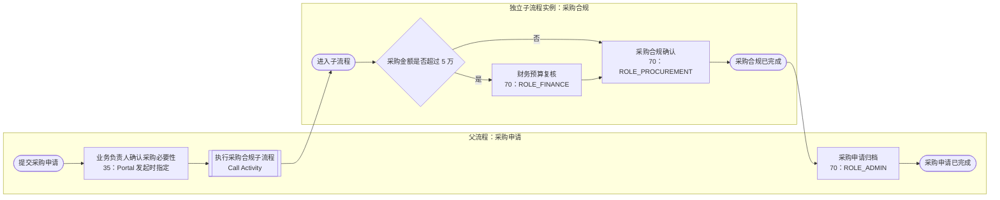

# 采购申请子流程 V1：节点、运行时与验收说明

本资产用于演示真正的 Flowable **Call Activity**：父流程调用一个独立、可部署的子流程定义。它不是图形上的嵌入式 subprocess；父、子会产生不同的流程实例和历史记录，父流程的审批详情通过 `activityNodes[].processInstanceId` 关联已完成的子流程实例。

## 交付资产与部署顺序

| 资产 | 用途 |
| --- | --- |
| `script/bpmn/purchase_requisition_compliance_subprocess_v1.bpmn.xml` | 被调用的采购合规子流程；必须先部署 |
| `script/bpmn/purchase_requisition_with_subprocess_v1.bpmn.xml` | 父流程；Call Activity 的 `calledElement` 按子流程 key 查找活动定义 |
| `script/sql/init-mock-data.sql` 与 `.sqlserver.sql` | 两个模型表单的可重复初始化；不写入流程运行数据 |
| `script/shell/test_purchase_requisition_with_subprocess_walkthrough.sh` | HTTP-only 运行验收，覆盖 3 万和 6 万两条路径 |

本地演练（仅限可丢弃环境）依次执行 mock SQL、启动 `yudao-bpm` 且开启 `yudao.bpm.headless-mock.enabled=true`，然后运行：

```bash
bash script/shell/test_purchase_requisition_with_subprocess_walkthrough.sh http://127.0.0.1:48080
```

脚本先部署子流程再部署父流程；部署接口使用实际查询得到的 `bpm_form.code` 对应 `formId`，不会写死表单主键。

## 流程与节点映射



| BPMN 节点 | 业务含义 | 身份与变量边界 | 实际运行时路径 | walkthrough 断言 |
| --- | --- | --- | --- | --- |
| `Activity_ParentManagerApproval` | 父流程先确认采购必要性 | `35`；Portal 在父流程发起时传 `portal-manager-b3c4` 一类最终 String ID | `BpmProcessInstanceServiceImpl.validateStartUserSelectAssignees` 校验当前父流程节点；`BpmTaskCandidateStartUserSelectStrategy` 原样取得 ID | 业务负责人拿到父流程待办 |
| `Activity_CallComplianceSubprocess` | 进入独立的采购合规流程 | `calledElementType="key"`；只显式传 `purchaseTitle`、`procurementType`、`totalAmount` 和运行状态 | Flowable 以 key 创建子流程实例；`BpmCallActivityListener` 根据 `listenerConfig={type:1,emptyType:1}` 以父流程发起人设置子流程身份 | 子任务属于子流程 definition ID，不是父实例；子流程完成后父流程才继续 |
| `Gateway_Sub_Amount` | 子流程内部金额分流 | `totalAmount > 50000` 才经过财务 | Flowable 在子流程变量作用域计算表达式 | 3 万没有财务待办；6 万先出现财务待办 |
| `Activity_Subprocess_FinanceReview` | 高金额预算复核 | `70` + `ROLE_FINANCE`；节点到达时才由 Portal 解算 | `PortalRoleCandidateStrategy` → `PortalRoleCandidateApi.resolveRoleAssigneeIds(...)` → `BpmTaskCandidateInvoker` | 仅 6 万由 `portal-finance-r8s9` 办理 |
| `Activity_Subprocess_ProcurementCompliance` | 采购合规确认 | `70` + `ROLE_PROCUREMENT` | 同上；不依赖父流程的 `startUserSelectAssignees` | 两条路径均由 `portal-procurement-q7r8` 办理 |
| `Activity_ParentArchive` | 子流程结束后恢复父流程并归档 | `70` + `ROLE_ADMIN`；独立于子流程候选人 | Call Activity 正常结束后，Flowable 继续父流程；Portal 角色适配器解算归档人 | 子流程审批详情状态为 `2` 且父流程才出现归档待办 |

## 为什么这能证明“子流程真的执行了”

1. 两个 BPMN XML 以不同 key、不同表单元数据部署；父流程不能在未部署子流程时可靠执行。
2. Call Activity 产生的子任务带有子流程的 `processDefinitionId`，脚本据此获取待办，不把父流程 ID 误当成子流程实例。
3. 子流程结束后，父流程审批详情的 Call Activity 节点包含 `calledProcessInstanceId`；脚本再次查询该 ID 并断言其状态为 `2`。
4. 只有子流程结束，父流程才会生成 `Activity_ParentArchive` 待办。这是父流程等待子流程完成后恢复的状态机语义。

`BpmProcessInstanceServiceImpl#getApproveNodeList` 已把 Flowable 历史中的 `CallActivity` 映射为节点类型 `20`，并透出 `calledProcessInstanceId`。Portal 只需用该字段继续查询子流程的审批详情，即可做“点击父流程中的子流程节点展开详情”的 UI。

## 已验证与外部前提

脚本的覆盖目标是：两个部署、Call Activity 父子实例关联、子流程的两条金额路径、`70` 动态候选人和子流程结束后的父流程恢复。它不把本地 `Local*Mock` 当作真实 Portal，也不声称 `LoggingBpmPortalNotificationApi` 已提供 Webhook/MQ 投递。生产演示应关闭 mock，并由 Portal 提供身份、角色候选人与认证适配器；无候选人时系统应失败关闭。
