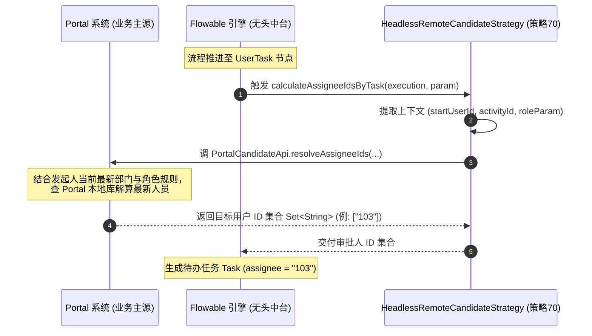

# ADR-001: 无头 BPM 远程候选人解算策略与零角色映射架构 (Headless Remote Candidate Strategy)

* **状态 (Status)**: 已接受 (Accepted)
* **日期 (Date)**: 2026-08-08
* **决策者 (Deciders)**: Antigravity AI, Project Architecture Team
* **标签 (Tags)**: Headless BPM, Flowable, Zero User Sync, Candidate Strategy, ADR

---

## 1. 上下文与背景 (Context & Problem Statement)

在传统的 BPM 工作流系统中，流程引擎通常紧耦合一套本地的用户表（`system_users`）、部门表（`system_dept`）与角色表（`system_role`）。流程节点（如“部门行政审批”）通过查找本地角色表与部门表来计算候选人。

然而，在 **无头工作流中台 (Headless / API-Driven BPM Engine)** 的定位下：
1. **Portal 是唯一的数据源头 (Single Source of Truth)**：所有的用户、部门、角色全量生存在 Portal 系统中；
2. **零用户数据同步 (Zero User Sync)**：BPM 平台不维护、也不同步 Portal 的角色与用户数据库；
3. **人员离职与动态变动风险**：如果流程在 Day 1 发起时把角色的具体 `userId` 预先静态硬编码，当流程在 Day 2 或一周后推进到该节点时，若原指定人员已离职或调岗，流程将会挂起 (Orphaned Task)；
4. **拒绝 Role Mapping 冗余**：如果在 BPM 端去建立并维护一张 Portal 到 BPM 的角色映射表（Role Mapping），会导致无头架构的腐化与两端状态不一致。

---

## 2. 决策方案 (Decision Outcome)

我们决定在 `yudao-module-bpm` 模块中实现并采用 **无头远程候选人解算策略 (Headless Remote Candidate Strategy)**：

### 2.1 核心设计

1. **注册专属策略枚举 (`HEADLESS_REMOTE = 70`)**：
   在 `BpmTaskCandidateStrategyEnum` 中定义专用于 Headless 模式的策略编号 `70` (`HEADLESS_REMOTE`)。
2. **解耦 SPI 接口定义 (`PortalCandidateApi`)**：
   策略类 [`HeadlessRemoteCandidateStrategy`](file:///Users/eden/Documents/coding/ruoyi-vue-pro/yudao-module-bpm/src/main/java/cn/iocoder/yudao/module/bpm/framework/flowable/core/candidate/strategy/headless/HeadlessRemoteCandidateStrategy.java) 不包含任何 BPM 本地角色与用户表的查询逻辑。
3. **运行期动态回调 (Task-Arrival Execution)**：
   当流程到达 UserTask 节点时，策略实时提取上下文参数 `(startUserId, activityId, roleParam, processInstanceId)`，通过 SPI 接口 / REST API 回调给 Portal。
4. **Portal 负责逻辑解算**：
   Portal 接收回调后，结合 Portal 本地的最新部门与角色数据，实时解算并返回目标审批人的字符串用户 ID 集合 `Set<String>`。

---

## 3. 架构序列图与数据流 (Sequence Diagram)

---

## 4. 架构影响与对立方案对比 (Consequences & Comparison)

| 评估维度 | 传统本地角色策略 (`ROLE = 10`) | 双端 Role Mapping 映射方案 | **本 ADR 决策: `HEADLESS_REMOTE (70)`** |
| :--- | :--- | :--- | :--- |
| **BPM 用户角色表依赖** | 强依赖 `system_role` / `system_user_role` | 需要额外的 Mapping 表 | **零依赖 (0 角色表, 0 用户表)** |
| **BPMN 参数 (Param)** | 需映射为 BPM 本地数字角色 ID | 需映射为转换 Key | **Portal 原生 Role Code 字符串 (如 `"DEPT_ADMIN"`)** |
| **离职/调岗处理** | 若静态硬编码会在离职时挂起 | 需要手动同步 Mapping 表 | **任务到达时（Day 2）实时回调解算，离职 0 挂起** |
| **Portal 业务规则变更** | 需要动 BPM 数据库和映射关系 | 需要更新 Mapping 表 | **Portal 侧自由修改，BPM 引擎 0 侵入、0 改码** |

---

## 5. 相关参考与代码实现 (References & Implementations)

* **策略实现类**: [`HeadlessRemoteCandidateStrategy.java`](file:///Users/eden/Documents/coding/ruoyi-vue-pro/yudao-module-bpm/src/main/java/cn/iocoder/yudao/module/bpm/framework/flowable/core/candidate/strategy/headless/HeadlessRemoteCandidateStrategy.java)
* **策略枚举类**: [`BpmTaskCandidateStrategyEnum.java`](file:///Users/eden/Documents/coding/ruoyi-vue-pro/yudao-module-bpm/src/main/java/cn/iocoder/yudao/module/bpm/framework/flowable/core/enums/BpmTaskCandidateStrategyEnum.java#L30-L33) (`HEADLESS_REMOTE = 70`)
* **全量无头架构文档**: [docs/PORTAL_HEADLESS_BPM_ARCHITECTURE.md](file:///Users/eden/Documents/coding/ruoyi-vue-pro/docs/PORTAL_HEADLESS_BPM_ARCHITECTURE.md)
